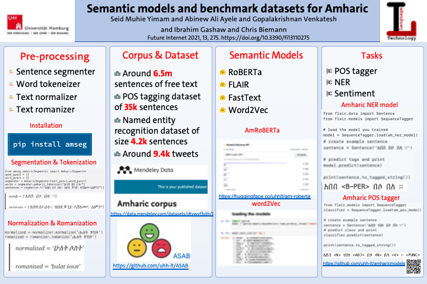

Read this [Medium article](https://medium.com/@seidymam/introducing-various-semantic-models-for-amharic-experimentation-and-evaluation-with-multiple-tasks-ef5c8ed063bc) for full discussion.
# Semantic Models for Amharic
 [](https://github.com/uhh-lt/amharicmodels/)

# Announcements 

###  :tada: :tada:  :tada: The Amharic RoBERTa model is uploaded in Huggingface [Amharic RoBERTa Model](https://huggingface.co/uhhlt/am-roberta) :tada: :tada: :tada:  [](https://huggingface.co/uhhlt/am-roberta)

###  :tada: :tada:  The Amharic FLAIR embedding model is integrated into the FLAIR library as [`am-forward`](https://github.com/flairNLP/flair/pull/2497) :tada: :tada:  The model will be accessible on the next FLAIR release. [Details](https://github.com/flairNLP/flair/blob/master/resources/docs/embeddings/FLAIR_EMBEDDINGS.md)

###  :tada: :tada:  The Amharic Segmenter is released and can be installed as [`pip install amseg`](https://pypi.org/project/amseg/) :tada: :tada: 

###  :tada: :tada:  The Flair based Amharic NER classifier model is now released [am-flair-ner](https://github.com/uhh-lt/amharicmodels/wiki/NLP-Tasks#ner) :tada: :tada: 

###  :tada: :tada:  The Flair based Amharic Sentiment classifier model is now released [am-flair-sent](https://github.com/uhh-lt/amharicmodels/wiki/NLP-Tasks#sentiment) :tada: :tada: 

###  :tada: :tada:  The Flair based Amharic POS tagger is now released [am-flair-pos](https://github.com/uhh-lt/amharicmodels/wiki/NLP-Tasks#pos-tagging) :tada: :tada: 


# Different semantic models and applications for Amharic
----
* [Introduction](https://github.com/uhh-lt/amharicmodels/wiki/home) 

* [Static word2Vec Embeddings](https://github.com/uhh-lt/amharicmodels/wiki/Static-Models)

* [Network Embeddings](https://github.com/uhh-lt/amharicmodels/wiki/Network-Embedding)

* [Contextual Embeddings](https://github.com/uhh-lt/amharicmodels/wiki/contextual)


----
# Tasks, Datasets and Preprocessing tools
* Here, we have described the different NLP tasks for which we built models using the benchmark datasets [Tasks](https://github.com/uhh-lt/amharicmodels/wiki/NLP-Tasks)
* [NER](https://github.com/uhh-lt/amharicmodels/wiki/NLP-Tasks#ner)
* [Sentiment](https://github.com/uhh-lt/amharicmodels/wiki/NLP-Tasks#sentiment)
* [POS tagging](https://github.com/uhh-lt/amharicmodels/wiki/NLP-Tasks#pos-tagging)
----
* The different datsets and resources are available under: [Datasets](https://github.com/uhh-lt/amharicmodels/wiki/Datasets)
* [Named Entity recognition dataset](https://github.com/uhh-lt/amharicmodels/wiki/Datasets#named-entity-recognition)
* [POS dataset](https://github.com/uhh-lt/amharicmodels/wiki/Datasets#named-entity-recognition)
* [Sentiment Dataset](https://github.com/uhh-lt/amharicmodels/wiki/Datasets#named-entity-recognition)
---

* For Amahric word segmentation and tokenization, check this project: [Segmentation](https://github.com/uhh-lt/amharicprocessor)
----

[](https://medium.com/@seidymam/introducing-various-semantic-models-for-amharic-experimentation-and-evaluation-with-multiple-tasks-ef5c8ed063bc)

## Publications

To cite the different Amharic NLP models and resources, use the following [paper](https://www.mdpi.com/1999-5903/13/11/275)

```
@Article{fi13110275,
AUTHOR = {Yimam, Seid Muhie and Ayele, Abinew Ali and Venkatesh, Gopalakrishnan and Gashaw, Ibrahim and Biemann, Chris},
TITLE = {Introducing Various Semantic Models for Amharic: Experimentation and Evaluation with Multiple Tasks and Datasets},
JOURNAL = {Future Internet},
VOLUME = {13},
YEAR = {2021},
NUMBER = {11},
ARTICLE-NUMBER = {275},
URL = {https://www.mdpi.com/1999-5903/13/11/275},
ISSN = {1999-5903},
DOI = {10.3390/fi13110275}
}

```


To cite the impacts of homophone normalization, use the the following [paper](https://www.inf.uni-hamburg.de/en/inst/ab/lt/publications/2021-belayetal-ict4da-amharicnorm.pdf)

```
@InProceedings{ayele2021,
AUTHOR = {Belay, Tadesse. Destaw and Ayele, Abinew Ali and Gelaye, Getie and Yimam, Seid Muhie and Biemann, Chris},
TITLE = {Impacts of Homophone Normalization on Semantic Models for Amharic},
booktitle = {Proceedings of the Third International Conference on ICT for Development for Africa (ICT4DA 2021)},
address = {Bahir Dar, Ethiopia}

}

```
