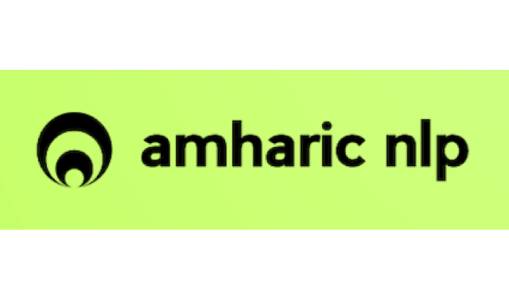

# Semantic Models for Amharic


# Announcements 

### :tada: :tada:  The Amharic RoBERTa model is uploaded in Huggingface [Movie Hate Speech Detection](https://huggingface.co/uhhlt/am-roberta) :tada: :tada  [](https://huggingface.co/uhhlt/am-roberta)


Different semantic models and applications for Amharic
----
# [Introduction](https://github.com/uhh-lt/amharicmodels/wiki/home) 
----
# Semantic Models 
## [Static semantic models](https://github.com/uhh-lt/amharicmodels/wiki/staticmodels)
## [Contextual Embeddings](https://github.com/uhh-lt/amharicmodels/wiki/contextual)


----
# [Tasks](https://github.com/uhh-lt/amharicmodels/wiki/NLP-Tasks)
----
# Datasets

----

## Publications

To cite the different Amharic NLP models and resources, use the following [paper](https://www.mdpi.com/1999-5903/13/11/275)

```
@Article{fi13110275,
AUTHOR = {Yimam, Seid Muhie and Ayele, Abinew Ali and Venkatesh, Gopalakrishnan and Gashaw, Ibrahim and Biemann, Chris},
TITLE = {Introducing Various Semantic Models for Amharic: Experimentation and Evaluation with Multiple Tasks and Datasets},
JOURNAL = {Future Internet},
VOLUME = {13},
YEAR = {2021},
NUMBER = {11},
ARTICLE-NUMBER = {275},
URL = {https://www.mdpi.com/1999-5903/13/11/275},
ISSN = {1999-5903},
DOI = {10.3390/fi13110275}
}

```


To cite the impacts of homophone normalization, use the the following [paper](https://www.inf.uni-hamburg.de/en/inst/ab/lt/publications/2021-belayetal-ict4da-amharicnorm.pdf)

```
@InProceedings{ayele2021,
AUTHOR = {Belay, Tadesse. Destaw and Ayele, Abinew Ali and Gelaye, Getie and Yimam, Seid Muhie and Biemann, Chris},
TITLE = {Impacts of Homophone Normalization on Semantic Models for Amharic},
booktitle = {Proceedings of the Third International Conference on ICT for Development for Africa (ICT4DA 2021)},
address = {Bahir Dar, Ethiopia}

}

```
