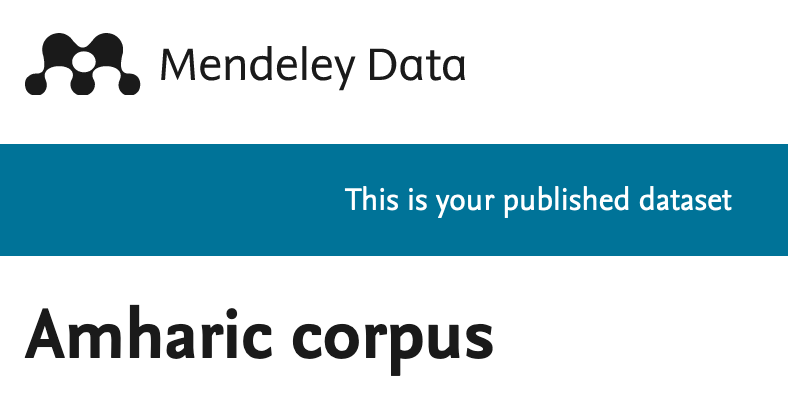

 
 
# Introduction
To build distributional semantic models, a large amount of text is required.
These days, an enormous amount of texts are being generated continuously from different sources. 
As we want to build general-purpose semantic models, we collected datasets from different channels, including news portals, social media texts, and general web corpus.

For the general web-corpus dataset, we used a focused web crawler to collect Amharic texts. 
Datasets from the Amharic Web Corpus (`Suchomel, V.; Rychlý, P. 206`) were also combined to a general-purpose data source. 
News articles were scraped from January 2020 until May 2020 on a daily basis using the [Python Scrappy tool](https://scrapy.org/). 
Similarly, using `Twitter` and `YouTube APIs`, we collected tweets and comments written in the `Fidel` script. 
In total, `6,151,995` sentences with over `335` million tokens were collected that are used to train the different semantic models.

The dataset are availbel in `Train`, `Development` and `Testing` set split in the [Mendeley Dataset Repository](https://data.mendeley.com/datasets/dtywyf3sth/1).

 
